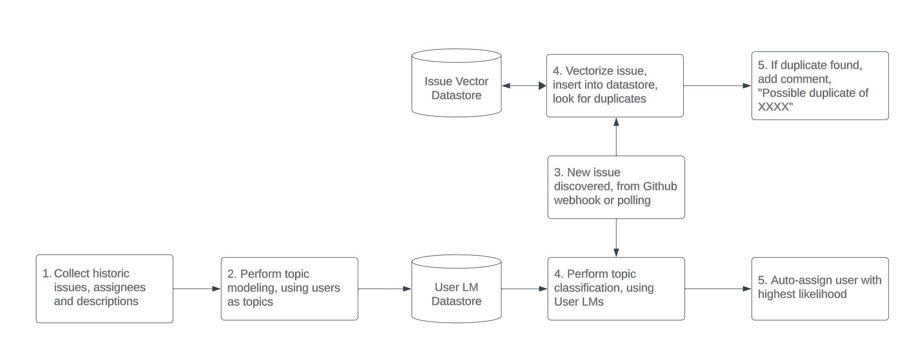
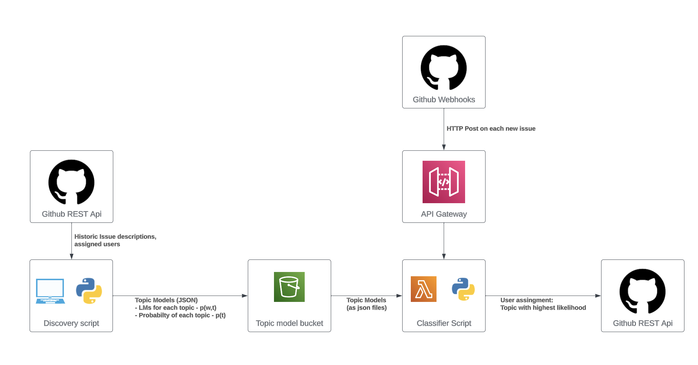
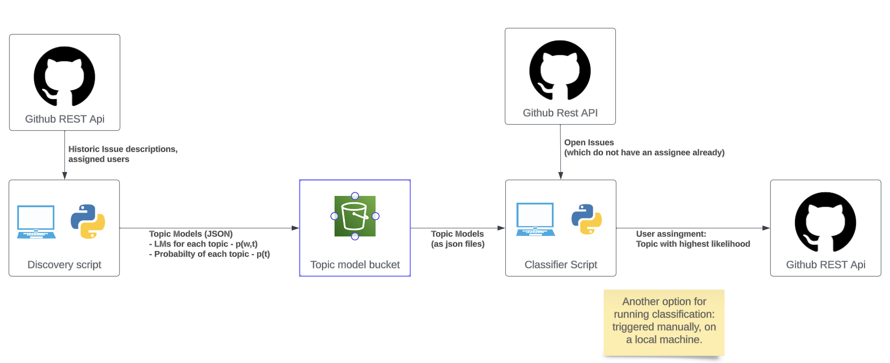

# Architecture

Process flow:

## Technical Architecture
NOTE: these diagrams only show the process for issue triage / classification. The architecture for issue de-duplication is the same, but the data-store may be changed to suite better querying of vectors.

Technical architecture - Using Github Webhooks:

- This solution is fully automatic, once the discovery script has been run, all new issues are classified on creation.
- If this were a real product, this gives the best user-experience, as long as our classification accuracy is pretty good.

Technical architecture - Running locally:

- This solution is less automatic, it requires someone to run both the discovery and classification scripts periodically.
- One benefit of this solution is we have the ability to look over the results before assigning users